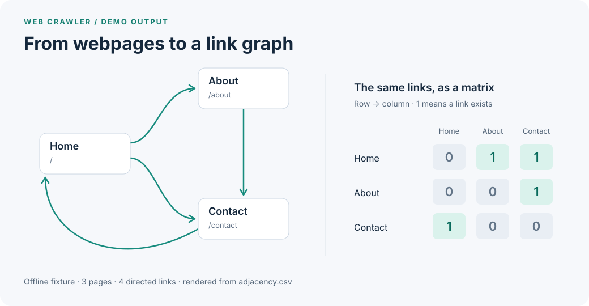

# Web Crawler & Link Graph Explorer

A Python crawler that extracts webpage text and maps the links between pages. Export readable content to CSV and inspect the crawl as a directed adjacency matrix.

**Python · Requests · Beautiful Soup · lxml · Pandas**

[Quick start](#quick-start) · [Sample data](examples/sample-output/output.csv) · [How it works](docs/design.md) · [Demo details](examples/README.md)



*Actual crawler output from three included HTML fixtures. The demo script renders the graph from the exported CSV; the crawler itself exports data.*

## What it does

- **Extracts text:** parses server-returned HTML, preferring `<main>` content when available.
- **Discovers links:** resolves relative URLs and uses a FIFO queue with visited-URL tracking.
- **Checks basic robots rules:** caches each site's successfully fetched rules and checks wildcard-agent `Disallow` paths.
- **Exports content and connections:** writes page text to `output.csv` and directed link relationships to `adjacency.csv`.

## Quick start

Tested with **Python 3.14.3** and the versions in `requirements.txt`. Use a virtual environment:

```bash
git clone https://github.com/joshuahernn/webScraper.git
cd webScraper
python3 -m venv .venv
source .venv/bin/activate
python -m pip install -r requirements.txt
python examples/run_demo.py
```

On Windows, use `py -3 -m venv .venv` and activate with `.venv\Scripts\Activate.ps1` in PowerShell.

The demo runs the real crawler with local HTML fixtures substituted for HTTP responses. It makes no network requests and verifies text extraction, relative links, a link cycle, a blocked path, and the CSV exports.

```text
Verified: 3 pages, 4 directed links, 1 blocked path.
Each page fetched once; robots.txt fetched once.
Saved demo artifacts to examples/sample-output/
```

See the [full captured run](examples/sample-output/terminal.txt) or [reproduce the example](examples/README.md).

## Sample output

These rows come directly from the demo's [`output.csv`](examples/sample-output/output.csv):

| URL | Text |
| --- | --- |
| `https://demo.example` | Crawler demo Three pages, one connected site. |
| `https://demo.example/about` | About This fixture demonstrates relative link discovery. |
| `https://demo.example/contact` | Contact The link home closes the cycle. |

In [`adjacency.csv`](examples/sample-output/adjacency.csv), column `0` refers to the URL in the first row, column `1` to the second, and so on. A `1` means the row's page links to the column's page.

## Crawl a website

```bash
python webScraper.py
```

Enter an HTTPS origin when prompted, such as `https://your-host.example` (replace it with a real site you are permitted to crawl). Use the origin without a trailing slash or a page path because of the current seed robots lookup.

The crawler can follow links to other domains and has no request delay. Before a live run, choose a controlled site and lower `max_pages` in `redirect_urls()` to suit it. The current value is 5,000 successfully extracted queued pages, excluding the seed; it is not a strict request limit.

Exports are written to the working directory. `output.csv` **appends** across runs, while `adjacency.csv` is replaced when a crawl finishes. Start in a fresh directory or move previous exports aside when you want separate datasets.

## Engineering decisions

| Choice | Why it is useful | Tradeoff |
| --- | --- | --- |
| Requests + Beautiful Soup/lxml | Makes fetching, parsing, and extraction easy to inspect | Does not render JavaScript |
| Queue + visited set | Processes links breadth-first and avoids repeated identical URLs | Equivalent URLs still need stronger normalization |
| Robots rules cache | Reuses rules across pages on the same origin | Supports only a subset of the protocol |
| Dense adjacency matrix | Makes a small site's link structure easy to inspect | Requires O(n²) entries as the URL count grows |

The demo's `Home → Contact → Home` cycle shows why visited tracking matters: each page is fetched once. Read the [implementation walkthrough](docs/design.md) for function responsibilities, export semantics, and further tradeoffs.

## Scope and next steps

This is an educational crawler for static HTML. It has five-second request timeouts, but seed error recovery, redirects, robots handling, and non-HTML responses need more work. Failed requests can leave graph entries without text rows. The offline demo verifies the included scenario, not general live-site reliability.

Next priorities are configurable crawl limits and domain scope, request pacing and stronger failure handling, and a compact edge-list export. See [current boundaries](docs/design.md#current-boundaries) for details.
